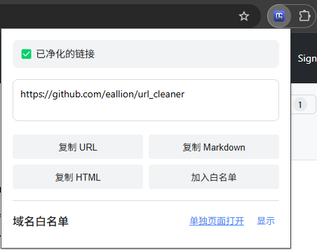

# 网址净化器

中文说明 | [[English](README.en.md)]

默认支持：淘宝、天猫、京东、1688、Google、GitHub、CSDN 等。

- github.com
- *.1688.com
- *.aliyun.com
- *.baidu.com
- *.bing.com
- *.bilibili.com
- *.fliggy.com
- *.google.com
- *.jd.com
- *.jd.hk
- *.so.com
- *.taobao.com
- *.tmall.com
- *.tmall.hk
- *.yandex.com
- *.csdn.net
- b23.tv
- cloud.tencent.com

可设置白名单，净化任意网址。

### 待办

- [ ] 添加订阅规则

### 贡献

欢迎 PR！
